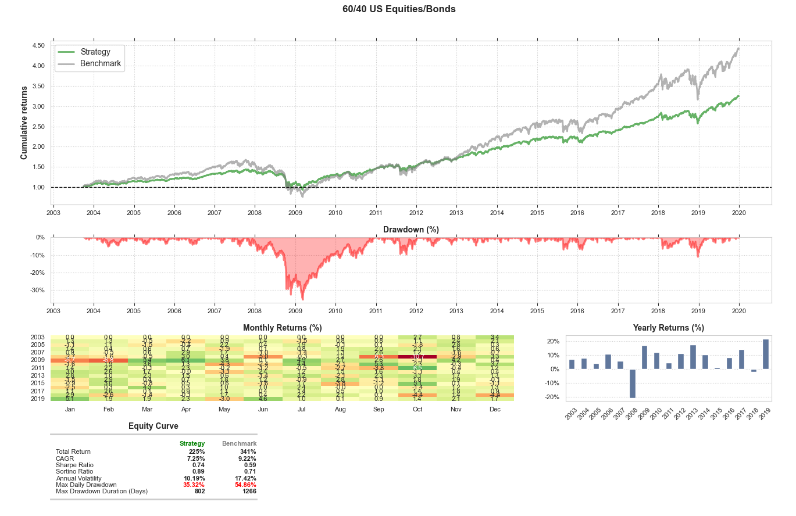

### 杂项

```txt
git restore fileName
```

modified之后,add之前,回退到上一次commit的时候的版本.



第一个金融分析图.有两个要注意:

```python
import pandas as pd
import yfinance as yf

def get_data(ticker, start_date, end_date):
    data = yf.download(ticker, start=start_date, end=end_date)

    if isinstance(data.columns, pd.MultiIndex):
        data.columns = data.columns.droplevel(-1)
        data.columns.name = None

    if(data.to_csv(f"{ticker}.csv")):
        print(f"Data for {ticker} saved to {ticker}.csv")
    else:
        print(f"Failed to save data for {ticker}")
```

`isinstance`函数指定`columns`为对象,不要写成`data`了. 抽象化后成为可以`import`的工具函数, 在每一个`examples`中可以灵活调用而不必硬编码或者反复下载. 

`columns`只有`Index`或者`MultiIndex`两种形态. `.columns.droplevel`指定抛弃某一层的索引,这里把聚合类名称扔掉.

```python
data_source = CSVDailyBarDataSource(csv_dir, Equity, csv_symbols=strategy_symbols, adjust_prices=False)
```

可见`CSVDailyBarDataSource`中的定义

```python
def __init__(self, csv_dir, asset_type, adjust_prices=True, csv_symbols=None):
        self.csv_dir = csv_dir
        self.asset_type = asset_type
        self.adjust_prices = adjust_prices
        self.csv_symbols = csv_symbols

        self.asset_bar_frames = self._load_csvs_into_dfs()
        self.asset_bid_ask_frames = self._convert_bars_into_bid_ask_dfs()
```

默认`adjusted_prices=True`,但注意yahoo通常没有`adjusted_price`这一栏,因此应该disable掉.

```python
import download
download.get_data(ticker, start, end)
```

对于自己写的脚本,直接import就可以使用了.

### 数据流分析

1. 设定`Timestamp`.

   ```python
   pd.Timestamp('2006-05-01', tz=pytz.UTC)
   ```

2. 设定`symbols`,`assets`,对应资产代码以及资产标识符.

   ```python
   strategy_symbols = ['GLD']
   strategy_assets = ['EQ:GLD']
   ```

   定义backtest中可以交易的资产集合类`StaticUniverse`. 注意其`get_assets`函数可以加入`pd.Timestamp`来转变为`DynamicUniverse`. :thinking:.

3. 设置环境变量(或使用默认目录),准备读取`csv`数据集.

   ```python
   csv_dir = os.environ.get('QSTRADER_CSV_DATA_DIR', '.')
   ```

   如果需要指定目录可以

   ```bash
   set QSTRADER_CSV_DATA_DIR=C:/data
   ```

4. 读取数据集,加载为`CSVDailyBarDataSource`类对象. 初始化函数为

   ```python
   def __init__(self, csv_dir, asset_type, csv_symbols = None, adjust_price = False)
   ```
   `csv_symbols`用于选取`csv_dir`数据池中需要的数据.

5. 绑定处理器,联系`universe`以及`data_source`,

6. 设定`AlphaModel`.负责在回测的每一天生成交易信号:

   ```python
   def __init__(self, signal_weights, universe=None, data_handler=None)
   ```

   这是策略核心,即如何调整`universe`资产池中的配置比例. :thinking:.

7. 启动`backtest`.

8. 绘制结果图.

### backtest分析

#### `run()`

1. 在`sim_engine`中生成事件.
2. 基于事件的`pd.Timestamp`,更新`broker`.
3. 如果有`signal`,在`"market_close"`时更新.
4. 考虑是否有`burn_in_dt`,如无或者`dt >= self.burn_in_dt`,检查`self._is_rebalance_enevt(dt)`,决定是否启动`self.qts(dt, stats)`.
5. 在`market_close`时更新每日表现`self._update_equity_curve(dt)`. 这一阶段`broker`会参与.
6. 遍历所有事件后,`self.output_holdings()`.

#### `sim_engine`

进一步解构, `event`由`{pd.Timestamp, event_type}`构成,一共有四种`event_type`:`["pre_market", "market_open","market_close", "post_market"]`.

其`pd.Timestamp`由

```python
days = pd.date_range(
            self.starting_day, self.ending_day, freq=BDay()
        )
```

生成. `freq`参数是筛选符合条件的日期,并根据事件类型细化到分钟. 也可用

```python
pd.bdate_range(start, end) # 默认工作日
```

#### `rebalance`

```python
def __init__(self, start_date, end_date, pre_market = False)
```

这个`pre_market`只是用于设置`rebalance`的时间节点,

```python
def _set_market_time(self, pre_market):
    return "14:30:00" if pre_market else "21:00:00"
```

#### `qts(QuantTradingSystem)`

这一阶段`broker`会参与. 最终目的是生成`rebalance`后的`portfolio`并提交给`broker`.

```python
self.qts = self._create_quant_trading_system(** kwargs)
```

`qts`有两种参数:`cash_buffer_percentage`以及`gross_leverage`.由剩余参数变量`kwargs`传递. 这个相当于是把除了显式列出来的参数都打包在一起.

1. `order_sizer`, 两种类型

   ```python
   if self.long_only:
       cash_buffer_percentage = kwargs['cash_buffer_percentage']
       order_sizer = DollarWeightedCashBufferOrderSizer(
       	self.broker,
           self.broker_portfolio_id,
           self.data_handler,
           cash_buffer_percentage = cash_buffer_percentage
       ) # 预算管理器
   ```

   ```python
   else:
       gross_leverage = kwargs['gross_leverage']
       order_sizer = LongShortLeveragedOrderSizer(...) # 风险限制器
   ```

   如果没有`short`,就不会有杠杆率,只关注`cash_buffer_percentage`. 当你做空时,手上的现金是增多的.

2. `optimizer`

3. `portfolio_construction_model` 

4. `execution_handler`

5. ```python
   rebalance_orders = self.portfolio_construction_model(dt, stats)
   self.execution_handler(dt, rebalance_orders)
   ```

   注意内置函数`__call__`,可以让对象变成一个函数, 同时使用该对象的元素.

   ```python
   def __call__(self, dt, stats=None)
   ```

> `cash_buffer_percentage`: 现金缓冲比率.
>
> `gross_leverage`:杠杆率, $L=\frac{Long+Short}{Equity}$.

#### `broker`

1. Update mid price
2. Execute orders.
